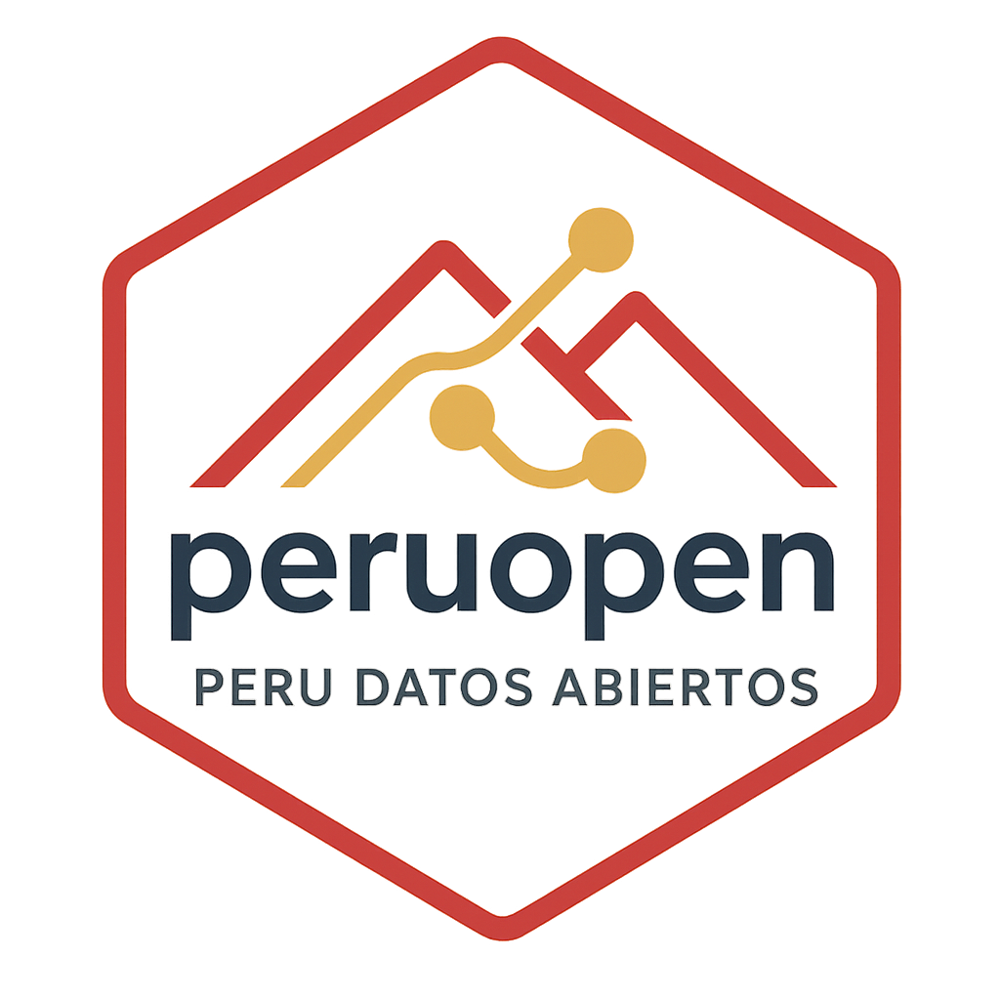

# Peru Open - Access Peru's Open Data Portal




<!-- badges: start -->
[](https://github.com/horaciochacon/peruopen/actions/workflows/R-CMD-check.yaml)
[](https://lifecycle.r-lib.org/articles/stages.html#experimental)
<!-- badges: end -->

**peruopen** provides a comprehensive R interface to Peru's CKAN data portal ([datosabiertos.gob.pe](https://datosabiertos.gob.pe)), enabling users to search, discover, and download open government datasets directly into R.

## Features

- 🔍 **Smart Search**: Search across 3,954+ datasets with flexible filtering by organization, format, and content
- 📊 **Data Catalog**: Browse complete catalog with metadata for datasets and 10,000+ resources  
- ⚡ **Fast Downloads**: Intelligent resource selection and caching for efficient data access
- 🎨 **Beautiful Output**: Colored console output for easy data exploration
- 🔄 **Robust API**: Built-in retry logic and error handling for reliable data access
- 📖 **Rich Metadata**: Access complete dataset information including organizations, formats, and descriptions

## Installation

You can install the development version of peruopen from [GitHub](https://github.com/) with:

``` r
# install.packages("devtools")
devtools::install_github("horaciochacon/peruopen")
```

## Quick Start

```r
library(peruopen)

# Get the complete data catalog (3,954 datasets, 10,000+ resources)
catalog <- po_catalog()

# Search for COVID-related data
covid_data <- po_search("covid")
covid_data

# Explore data by topic
health_data <- po_explore("salud")
health_data

# Download a specific dataset
malaria_data <- po_get("malaria-2024")

# Find all CSV files about dengue
dengue_csv <- po_search("dengue", formats = "CSV")
```

## Main Functions

| Function | Purpose |
|----------|---------|
| `po_catalog()` | Get complete data catalog with datasets and resources |
| `po_search()` | Search datasets by keywords, tags, formats, organizations |
| `po_explore()` | Interactive exploration with summaries by different dimensions |
| `po_get()` | Smart data download with automatic format selection |

## Examples

### Search and Filter Data

```r
# Search across all fields
climate_data <- po_search("cambio climático")

# Filter by organization
minsa_data <- po_search(organizations = "MINSA")

# Find specific file formats
excel_files <- po_search(formats = c("XLSX", "XLS"))

# Search only in tags
health_tags <- po_search("salud", search_tags_only = TRUE)
```

### Data Exploration

```r
# Explore all available data
overview <- po_explore()

# Focus on specific topic
education <- po_explore("educación")

# See what organizations publish data
overview$by_organization
```

### Smart Data Downloads

```r
# Download best available resource from dataset
data <- po_get("covid-vaccinations")

# Get specific format
csv_data <- po_get("dataset-name", format = "CSV")

# Download multiple resources
resources <- catalog$resources %>% 
  filter(format == "CSV", size_mb < 50)
all_data <- po_get(resources)

# Save files locally
po_get("dataset-name", save_to = "data/peru/")
```

## Data Coverage

The Peru open data portal contains:

- **3,954 datasets** from 283+ government organizations
- **10,000+ resources** in multiple formats (CSV, Excel, JSON, PDF, etc.)
- **~1.7 TB** of total data across all resources
- Regular updates from ministries, regional governments, and agencies

## Peru's Open Data Ecosystem

This package connects to Peru's official open data portal, which provides access to datasets from:

- **MINSA** (Ministry of Health) - Health statistics, epidemiological data
- **MEF** (Ministry of Economy) - Budget execution, economic indicators  
- **MINEDU** (Ministry of Education) - Educational statistics
- **INEI** (National Statistics Institute) - Census, demographic data
- **Regional Governments** - Local statistics and programs
- **And 278+ more organizations**

## Getting Help

- See `vignette("getting-started")` for detailed examples
- Browse the [function reference](https://horaciochacon.github.io/peruopen/reference/)
- Report bugs at [github.com/horaciochacon/peruopen/issues](https://github.com/horaciochacon/peruopen/issues)

## Code of Conduct

Please note that the peruopen project is released with a [Contributor Code of Conduct](https://contributor-covenant.org/version/2/1/CODE_OF_CONDUCT.html). By contributing to this project, you agree to abide by its terms.

## License

MIT © [Horacio Chacón-Torrico](https://github.com/horaciochacon)